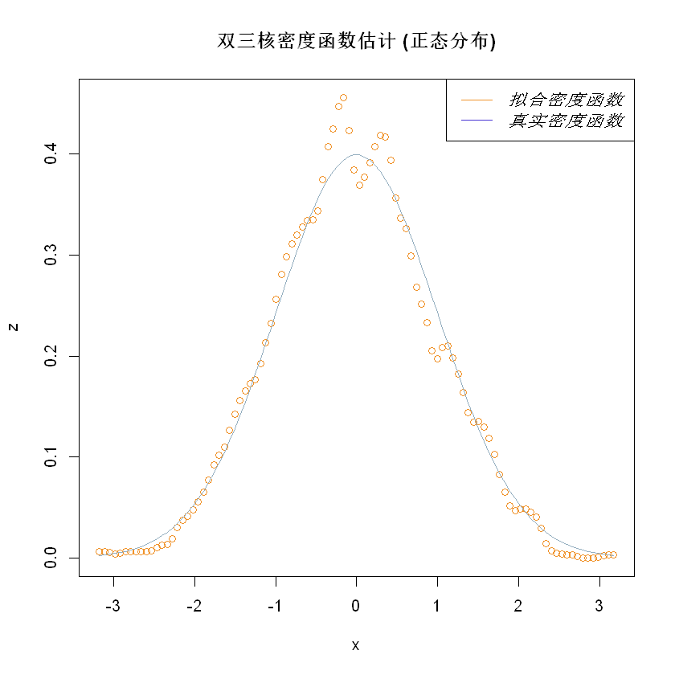
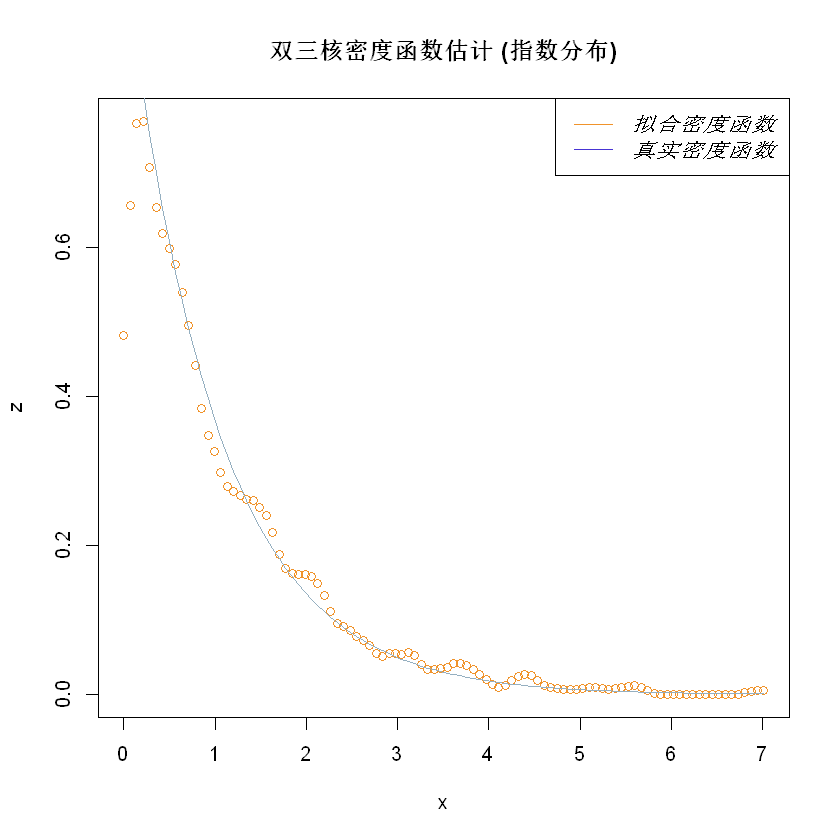
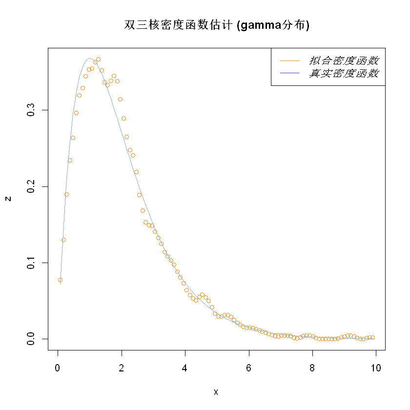

# BicubicKernelDensityEstimate

## 1.introduction

    估计样本密度函数的一种方法:双核密度估计

```

Rscript bicubicKernelFunction.R

```

## 2.test
* 正态分布(参数：0,1)

* 指数分布(参数:1)

* gamma分布(参数:2,1)

* beta分布(参数:5,5)
